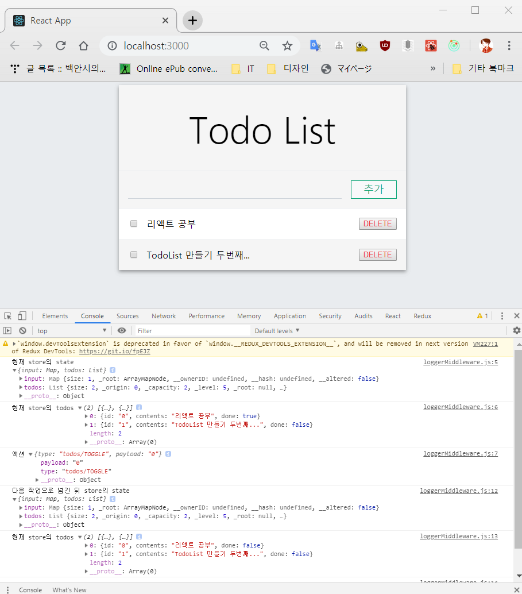

# 미들웨어(Middleware)
- 액션과 리듀서 사이의 중간장치
- 액션을 디스패치 했을 때 리듀서에서 처리하기 전에 사전에 지정된 작업들(전달받은 액션을 콘솔에 기록하거나, 액션 정보를 기반으로 액션을 취소하거나 다른 액션을 실행하는 등의)을 실행한다.

## 미들웨어 직접 만들고 적용
- 미들웨어 내부에서 store.dispatch를 사용할 때, 특정 조건을 만족하면 같은 액션이 아니라 다른 액션으로 실행하게끔 만든다.
- /lib/loggerMiddleware.js
    ```javascript
    const loggerMiddleware = store => next => action => {
        console.log("현재 store의 state", store.getState());
        console.log("현재 store의 todos", store.getState().todos.toJS()); // state안의 todos 출력
        console.log("액션", action);
        
        // 액션을 다음 미들웨어 또는 리듀서로 넘긴다.
        const result = next(action);
        
        console.log("다음 작업으로 넘긴 뒤 store의 state", store.getState());
        console.log("현재 store의 todos", store.getState().todos.toJS());
        console.log("\n"); // 로그 구분용 newLine

        // store.dispatch(ACTION_TYPE) 했을 때(리듀서로 갔을 때)의 결과
        return result;
    };

    export default loggerMiddleware;
    ```
- 적용하기 : store.js
    ```javascript
    import { createStore, applyMiddleware, compose } from "redux";
    import modules from "./modules";
    import loggerMiddleware from "./lib/loggerMiddleware";

    const store = createStore(
        modules,
        compose(
            applyMiddleware(
                loggerMiddleware
            ),
            window.devToolsExtension && window.devToolsExtension()
        )
    );

    export default store;
    ```
    - `compose()`
        - redux 에서 제공하는 함수형 프로그래밍 유틸리티
        - 여러 스토어 인핸서들을 순차적으로(오른쪽에서 왼쪽으로) 적용시키는 함수를 반환한다.
    - `applyMiddleware()`
        - 여러 개의 미들웨어를 묶어서 전달해주는 역할
        - 미들웨어 순서는 applyMiddleware에 전달한 파라미터 순서대로 지정된다.
- 적용 후


### redux-logger
- 설치
    ```s
    $ yarn add redux-logger
    ```
- 적용
    ```javascript
    import { createStore, applyMiddleware, compose } from "redux";
    import modules from "./modules";
    import logger from "redux-logger";


    const store = createStore(
        modules,
        compose(
            applyMiddleware(
                logger
            ),
            window.devToolsExtension && window.devToolsExtension()
        )
    );

    export default store;
    ```
    - redux-logger에서 제공하는 createLogger 를 사용하면 옵션을 지정해 로거를 생성할 수 있다.
    - [https://github.com/LogRocket/redux-logger#options](https://github.com/LogRocket/redux-logger#options) createLogger에서 사용하는 옵션. 책에 있던 주소가 바뀌었다.

## 비동기 작업을 처리하는 미들웨어

### redux-thunk
- 리덕스를 사용하는 애플리케이션에서 비동기 작업을 처리할 때 사용하는 가장 기본적인 방법
- 리덕스를 개발한 댄 아브라모프가 만듦. 직관적이고 간단하다.
- 객체가 아닌 함수도 디스패치 할 수 있게 만들어, 특정 액션을 디스패치 한 뒤 몇초 뒤에 반영시키는 작업 등 일반 액션 객체로는 할 수 없는 일도 할 수 있게 한다.

#### thunk?
특정 작업을 나중으로 미루기 위해 함수형태로 감싼 것.

    ```javascript
    // 일반적인 작업. 선언하고 바로 작업이 수행됨
    const str = "사과 " + "바나나";

    // thunk 로 만들기. 함수로 만들면 이 작업을 호출할때만 작업이 수행된다.
    const thunk = () => "사과 " + "바나나";
    ```

#### thunkCreator
액션 객체가 아닌 함수를 반환하는 함수를 thunk 생성 함수라고 한다. thunk 생성 함수는 dispatch, getState를 파라미터로 가지는 새로운 함수를 만들어 반환해야 한다.

#### 설치 및 적용
- 설치
    ```s
    $ yarn add redux-thunk
    ```

- 적용
    - 스토어에 ReduxThunk 추가하기
    ```javascript
    // 리덕스 관련 불러오기
    import { createStore, applyMiddleware } from "redux";
    import module from "./modules/counter";
    import ReduxThunk from "redux-thunk";
    import logger from "redux-logger";

    export default createStore(module, applyMiddleware(logger, ReduxThunk));
    ```

    - counter.js 모듈에 thunkCreator 추가
    ```javascript
    ...
    export const increamentAcync = index => dispatch => {
        setTimeout(() => {
            dispatch(increament(index));
        }, 1000);
    };

    export const decreamentAcync = index => dispatch => {
        setTimeout(() => {
            dispatch(decreament(index));
        }, 1000);
    };
    ...
    ```

    - 컨테이너 컴포넌트에 바뀐 액션 생성 함수 전달해주기
    ```javascript
    import React from "react";
    import CounterList from "../components/CounterList";
    import {connect} from "react-redux";
    import { bindActionCreators } from "redux";
    import * as counterActions from "../modules/counter";

    // 데이터와 함수들을 props로 받는 컴포넌트 생성후
    // 표시해 줄 컴포넌트를 넣어준다.

    const CounterListContainer = ({ counters, counterAction }) => {
        return (
            <CounterList
            counters={counters}
            onIncreament={counterAction.increamentAcync}
            onDecreament={counterAction.decreamentAcync}
            onSetColor={counterAction.setColor}
            />
        );
    };

    export default connect(
        state => ({ counters: state }),
        dispatch => ({ counterAction: bindActionCreators(counterActions, dispatch) })
    )(CounterListContainer);
    ```